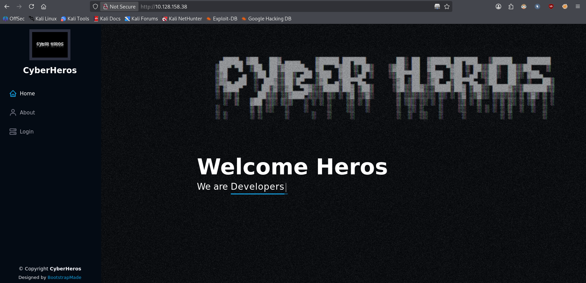
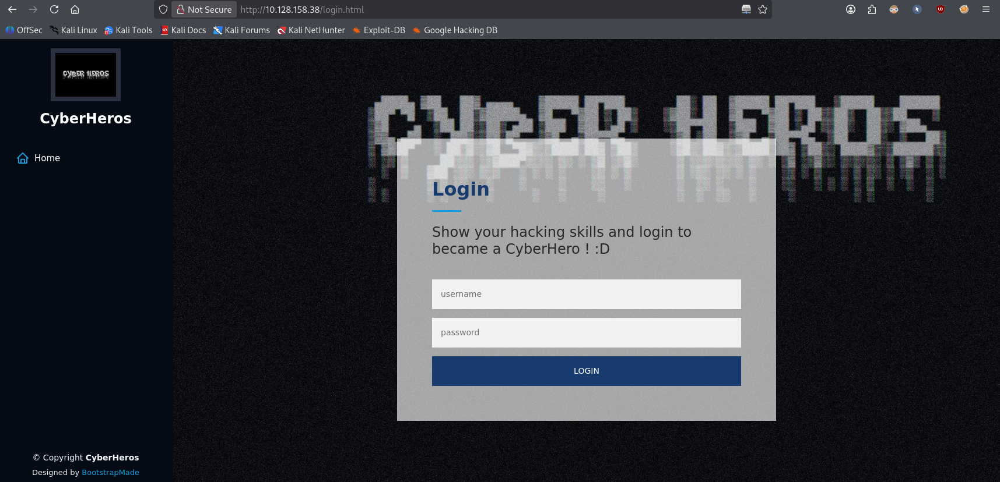
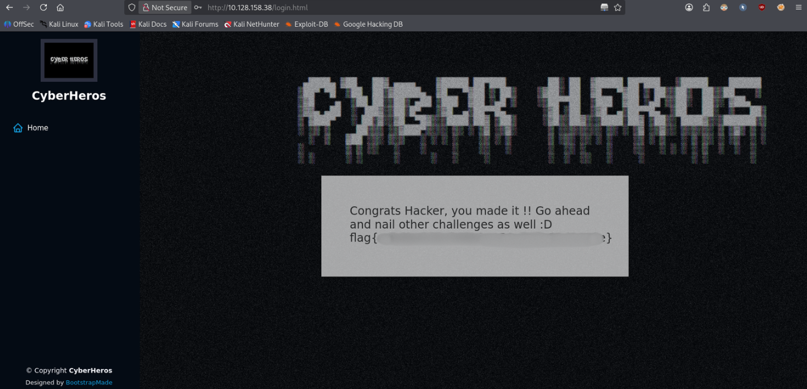

# CyberHeroes


> A beginner web room about client-side authentication done wrong — the "login check" lives entirely in JavaScript shipped to the browser, so reading the page source is enough to walk straight in.

**Task:** find a way to log in and prove you're worthy of joining the CyberHeroes.

**Room link:** https://tryhackme.com/room/cyberheroes

---

## 1. Verify the machine is running

```bash
ping -c 3 10.128.158.38
```

- `-c 3` sends exactly 3 ICMP echo requests and then stops, instead of pinging forever.

```
PING 10.128.158.38 (10.128.158.38) 56(84) bytes of data.
64 bytes from 10.128.158.38: icmp_seq=1 ttl=62 time=9.56 ms
64 bytes from 10.128.158.38: icmp_seq=2 ttl=62 time=8.85 ms
64 bytes from 10.128.158.38: icmp_seq=3 ttl=62 time=8.42 ms

--- 10.128.158.38 ping statistics ---
3 packets transmitted, 3 received, 0% packet loss, time 2004ms
rtt min/avg/max/mdev = 8.417/8.944/9.563/0.472 ms
```

0% packet loss confirms the machine is up and reachable.

## 2. Port scanning with Nmap

```bash
nmap -sC -sV 10.128.158.38
```

- `-sC` runs Nmap's **default script set** (`--script=default`), a collection of safe, non-intrusive NSE scripts that grab extra banner/version/config info (e.g. `http-title`, `http-server-header` below).
- `-sV` enables **version detection**, so Nmap tries to identify the exact product and version behind each open port instead of just naming the service.
- No `-p` is given, so Nmap scans its default list of the 1000 most common TCP ports.

```
PORT   STATE SERVICE VERSION
22/tcp open  ssh     OpenSSH 8.2p1 Ubuntu 4ubuntu0.4 (Ubuntu Linux; protocol 2.0)
80/tcp open  http    Apache httpd 2.4.48 ((Ubuntu))
|_http-title: CyberHeros : Index
|_http-server-header: Apache/2.4.48 (Ubuntu)
```

Two open ports: SSH (22) and an Apache web server (80). Since the task is specifically about logging in, the web app on port 80 is the obvious target.

## 3. Exploring the website

Browsing to the site shows a simple front page with **Home**, **About** and **Login** links.



Since the goal is explicitly to log in, we head straight to the login page.



## 4. Reading the page source

The login form itself is unremarkable HTML, but the real logic is in an inline `<script>` block — and client-side code is always visible to the user, so it's the first thing worth reading on any "login" challenge like this:

```javascript
function authenticate() {
  a = document.getElementById('uname')
  b = document.getElementById('pass')
  const RevereString = str => [...str].reverse().join('');
  if (a.value=="h3ck3rBoi" & b.value==RevereString("54321@terceSrepuS")) {
    var xhttp = new XMLHttpRequest();
    xhttp.onreadystatechange = function() {
      if (this.readyState == 4 && this.status == 200) {
        document.getElementById("flag").innerHTML = this.responseText ;
        document.getElementById("todel").innerHTML = "";
        document.getElementById("rm").remove() ;
      }
    };
    xhttp.open("GET", "RandomLo0o0o0o0o0o0o0o0o0o0gpath12345_Flag_"+a.value+"_"+b.value+".txt", true);
    xhttp.send();
  }
  else {
    alert("Incorrect Password, try again.. you got this hacker !")
  }
}
```

Breaking this down:

- There's no server-side authentication at all. The entire check — username, password, and what happens on success — is hardcoded in JavaScript that ships straight to the browser.
- `a.value=="h3ck3rBoi"` means the expected **username** is the literal string `h3ck3rBoi`.
- `b.value==RevereString("54321@terceSrepuS")` means the expected **password** isn't stored directly — it's the *reverse* of the string `54321@terceSrepuS`, computed on the fly by the `RevereString` helper (`[...str].reverse().join('')`, i.e. split into characters, reverse the array, join back into a string).
- On a correct match, the script fires an `XMLHttpRequest` (`xhttp`) to fetch a flag file whose name is built from the credentials themselves: `RandomLo0o0o0o0o0o0o0o0o0o0gpath12345_Flag_<username>_<password>.txt` — so the "backend" is really just a static file whose path happens to encode the valid credentials.

So all we need is the reversed string.

## 5. Reversing the password string

```bash
echo "54321@terceSrepuS" | rev
```

- `echo "..."` prints the string, and the pipe (`|`) feeds it into the next command.
- `rev` reverses the characters of each input line.

```
SuperSecret@12345
```

That gives us the real password.

## 6. Logging in

Credentials:

| Field    | Value               |
|----------|----------------------|
| Username | `h3ck3rBoi`           |
| Password | `SuperSecret@12345`   |

Entering these into the login form satisfies the JavaScript check, the `XMLHttpRequest` fires, and the flag file's contents are injected into the page.



Room solved.

---

## Takeaways

- **Never trust the client**: any authentication, authorization, or secret-handling logic that runs in the browser (JavaScript, HTML, CSS) is fully readable and reversible by the user — "View Source" is all it takes.
- Obfuscating a secret with a trivial transform (here, simply reversing the string) adds essentially no real security; it only slows down a human reading the raw source for a few seconds.
- Building a "protected" resource's filename or path out of the credentials used to unlock it is just another form of client-side secret — the browser has to know the full path to fetch it, so it's never actually hidden from the user.

**Mitigation:**
- Perform authentication **server-side** only: the client should submit credentials to a server endpoint and receive a session token or redirect, never compute the pass/fail decision itself.
- Never ship real secrets, credentials, or sensitive file paths in client-side JavaScript or HTML — anything sent to the browser must be treated as public.
- Gate sensitive resources (like a flag file) behind proper server-side access control, not an obscure/unguessable filename.